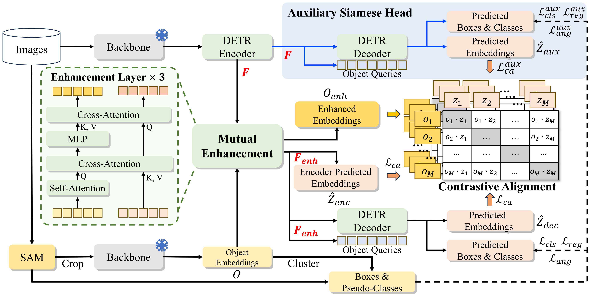
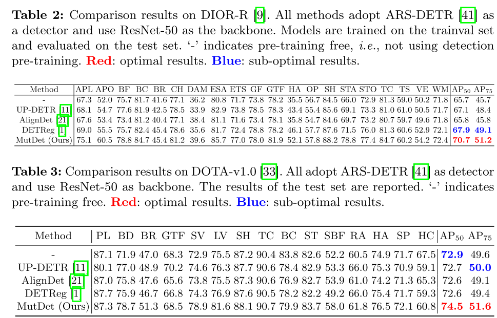

# MutDet: Mutually Optimizing Pre-training for Remote Sensing Object Detection
[Paper][Citing][Appendix] (under construction)

Welcome to the official repository of [MutDet](https://arxiv.org/abs/2103.16607). 
In this work, we propose a pre-training method for object detection in remote sensing images, which can be applied to any DETR-based detector and theoretically extended to other single-stage or two-stage detectors.
Our paper is accepted by ECCV 2024. 




```
The Arxiv link
```


## Preparation

Please install Python dependencies Following  [ARS-DETR](https://github.com/httle/ARS-DETR) and  [Segment-Anything](https://github.com/facebookresearch/segment-anything). 


## Datasets

We will release it later.

## The MutDet Framework

Our pre-training framework consists of three steps: 
1. Pseudo-label generation: Using SAM to generate pseudo-boxes, extracting object embeddings using a pre-trained model, and clustring to get labels.  
2. Detection Pre-training: Keeping the backbone frozen and conducting detection pre-training. 
3. Fine-tuning: Fine-tuning on downstream data.

### 1. Pseudo-label generation
`Due to the complexity of the data annotation process, we have decided to gradually improve this repository and release the code for reference in the meantime.`

#### 1.1. Divide dataset for parallel use with SAM 
Generate a dataset split for manually parallel running SAM to generate pseudo-labels:
```shell
python ./Step1_Prepare_SAM_prediction/step1_1_partition_DOTA_800_600.py
```
#### 1.2. Predict mask with SAM
Use SAM to autonomously generate pseudo masks: 
```shell
python ./Step1_Prepare_SAM_prediction/step1_2_seg_DOTA_800_600.py
```
#### 1.3. transform mask to rotated box:
Convert these masks into rotated boxes using the minimum bounding box algorithm: 
```shell
python ./Step1_Prepare_SAM_prediction/step1_3_mask_to_poly_DOTA_800_600.py
```
#### 1.4. extract object embeddings
Use pre-trained ResNet-50 on ImageNet to extract object embeddings:
```shell
python ./tools/train.py ./configs/Step1_4_Prepare_extract_embeddings/Tool_DOTA_train_Feats.py
```

#### 1.5. Format Pseudo-dataset
Reduce the dimension of object embeddings using PCA, and cluster to obtain pseudo-labels
```shell
python ./Step1_Prepare_SAM_prediction/step1_5_cluster_and_make_pslabels.py
```

#### 2. Detection Pre-training
Pre-training with MutDet framework: 
```shell
python ./train.py ./configs/Step2_DetectionPretraining_Mutdet/MutDet_DOTA_Pretrain.py
```

#### 3. Fine-tuning 
Fine-tuning with downstream dataset
```shell
python ./train.py ./configs/Step3_Finetuning/ars_detr_DIOR_MutDet.py
```
Checkpoints retained during the pre-training process can be directly used to initialize the detector. During initialization, warnings such as 'parameter mismatch' may occur, which is due to MutDet introducing additional modules and using a 256-dimensional classification head. However, the remaining parameters of the detector can be inherited normally, thus not affecting the pre-training effectiveness.

### Results on DOTA and DIOR




### Pre-trained Models
| Name     | architecture | dataset         | google drive | Baidu Cloud                                                             |
|----------|--------------|-----------------|-------------|-------------------------------------------------------------------------|
| MutDet   | ResNet-50    | DOTA-v1.0 train | To do       | [download](https://pan.baidu.com/s/1BfvVtRjL1kafNEjaN3913A?pwd=wt0d) (wt0d) |
| MutDet | Swin-T       | RSDet4          | To do       |  [download](https://pan.baidu.com/s/1Kq-0Mj8zy8f79v_uA0BjqA?pwd=7wsd) (7wsd) |
